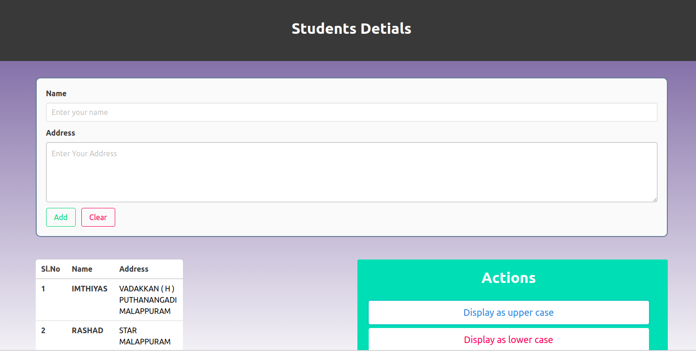

# RESTful API using Node.js and Client Application


# Contents

* A RESTful API which has to endpoints to convert strings to capital letters and small letters
* A client web application which works with the above API


# Run Web Server

```zsh
cd WebTechnology-Assignment1/server/RESTful API
npm install
npm start
```

# Run Web Client

open index.html from WebTechnology-Assignment1/client/public in a browser

# Demo


